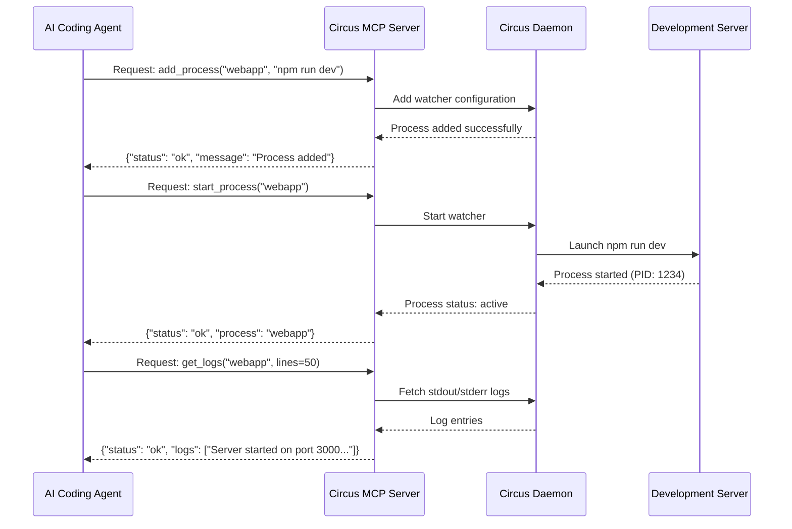

# Circus MCP

[](https://badge.fury.io/py/circus-mcp)
[](https://www.python.org/downloads/)
[](https://opensource.org/licenses/MIT)

**Simplify development server management and log reading for AI coding agents.**

Circus MCP provides coding agents with streamlined access to development server startup and log monitoring through the Model Context Protocol (MCP). By offering direct process management capabilities, it eliminates the complexity of shell command parsing and reduces token consumption for AI agents working in development environments.

## MCP Integration Sequence



## What is Circus MCP?

In today's complex microservices development landscape, Circus MCP enables AI coding agents to work more efficiently, contributing to society through better development productivity.

Circus MCP provides direct process control through the Model Context Protocol, eliminating the overhead of shell commands and reducing token consumption for AI agents managing development environments.

**Core Features**:

- **AI Integration**: Built-in MCP protocol support for coding agents
- **Simple Commands**: Easy-to-use CLI for developers
- **Smart Operations**: Idempotent commands that work reliably
- **Microservices Ready**: Manage multiple services effortlessly

## Quick Start

### Installation

```bash
uv add circus-mcp
```

### Basic Usage

```bash
# Start the daemon
uv run circus-mcp start-daemon

# Add and start a web application
uv run circus-mcp add webapp "python app.py"
uv run circus-mcp start webapp

# Check what's running
uv run circus-mcp overview

# View logs
uv run circus-mcp logs webapp
```

That's it! Your process is now managed by Circus MCP.

## Key Features

### 🚀 Process Management Made Easy

```bash
# Add processes with options
uv run circus-mcp add api "uvicorn app:api" --numprocesses 4 --working-dir /app

# Smart operations (won't fail if already running)
uv run circus-mcp ensure-started api

# Bulk operations
uv run circus-mcp start-all
uv run circus-mcp restart-all
```

### 📊 Comprehensive Monitoring

```bash
# Beautiful overview of all services
uv run circus-mcp overview

# Detailed status information
uv run circus-mcp status-all

# Real-time log viewing
uv run circus-mcp tail api
uv run circus-mcp logs-all
```

### 🤖 AI Agent Integration

Circus MCP includes built-in MCP protocol support, allowing AI agents to manage your processes:

```bash
# Start MCP server for AI integration
uv run circus-mcp mcp
```

Configure in your AI agent using the **recommended stdio transport**:

```json
{
  "mcpServers": {
    "circus-mcp": {
      "command": "uv",
      "args": ["run", "circus-mcp", "mcp"]
    }
  }
}
```

**Note**: This tool is designed for local development environments using MCP's stdio transport method as specified in the [MCP documentation](https://modelcontextprotocol.io/). This approach provides secure, direct communication between AI agents and the process manager.

## Common Use Cases

### Web Application Management

```bash
# Production web app with multiple workers
uv run circus-mcp add webapp "gunicorn app:application" --numprocesses 4
uv run circus-mcp add worker "celery worker -A app" --numprocesses 2
uv run circus-mcp ensure-started all
```

### Development Environment

```bash
# Start your development stack
uv run circus-mcp add frontend "npm run dev" --working-dir /app/frontend
uv run circus-mcp add backend "python manage.py runserver" --working-dir /app/backend
uv run circus-mcp add redis "redis-server"
uv run circus-mcp start-all
```

### Microservices

```bash
# Manage multiple services
uv run circus-mcp add auth-service "python auth_service.py"
uv run circus-mcp add user-service "python user_service.py"
uv run circus-mcp add notification-service "python notification_service.py"
uv run circus-mcp ensure-started all
```

## Why Circus MCP?

### Why Circus for AI Agents (vs. Supervisord)

Circus is better suited for AI agent process management than Supervisord due to API completeness:

| Aspect                       | Circus                                                                     | Supervisord                                                          |
| ---------------------------- | -------------------------------------------------------------------------- | -------------------------------------------------------------------- |
| **Dynamic process addition** | Add processes dynamically via ZeroMQ API                                   | Not supported via XML-RPC. Requires manual conf file edit + `reload` |
| **API completeness**         | `add`, `start`, `stop`, `restart`, `status`, `stats`, `logs` — all via API | `add_process` not supported via API (returns warning only)           |
| **Log retrieval**            | stdout + stderr in a single call                                           | stdout and stderr require separate calls                             |
| **System stats**             | CPU, memory, uptime available via API                                      | Version info only. No resource metrics                               |
| **Idempotent operations**    | Built-in `ensure_started` / `ensure_stopped`                               | Starting an already-running process throws `ALREADY_STARTED` error   |
| **Transport**                | ZeroMQ (fast, async)                                                       | HTTP XML-RPC (synchronous, higher overhead)                          |

**Conclusion**: Supervisord is ideal for static, config-file-based operations. However, for AI agents that need to dynamically add, monitor, and debug processes, **Supervisord's API limitations become a barrier**. Circus exposes all operations via API, making it the better choice for AI agent integration.

### vs. Docker Compose

- **Lighter**: No containers needed, just process management
- **Faster**: Direct process execution, no container overhead
- **Simpler**: One command to rule them all

### vs. systemd

- **User-friendly**: Simple commands instead of unit files
- **Cross-platform**: Works on any system with Python
- **AI-ready**: Built-in MCP support for automation

### vs. PM2

- **Python-native**: Perfect for Python applications
- **AI integration**: MCP protocol support out of the box
- **Comprehensive**: Process + log management in one tool

## Advanced Features

### Intelligent State Management

```bash
# These commands are safe to run multiple times
uv run circus-mcp ensure-started webapp    # Only starts if not running
uv run circus-mcp ensure-stopped worker    # Only stops if running
```

### Bulk Operations

```bash
# Work with all processes at once
uv run circus-mcp start-all     # Start everything
uv run circus-mcp stop-all      # Stop everything
uv run circus-mcp restart-all   # Restart everything
uv run circus-mcp logs-all      # See all logs
```

### Log Management

```bash
# View logs with filtering
uv run circus-mcp logs webapp --lines 100 --stream stderr
uv run circus-mcp tail webapp --stream stdout

# See recent activity across all services
uv run circus-mcp logs-all
```

## Installation & Setup

### System Requirements

- Python 3.10 or higher
- Any operating system (Linux, macOS, Windows)

### Installation Options

```bash
# From PyPI (recommended)
uv add circus-mcp

# With pip (alternative)
pip install circus-mcp

# From source
git clone https://github.com/aether-platform/circus-mcp.git
cd circus-mcp
uv sync
```

### Verify Installation

```bash
uv run circus-mcp --help
uv run circus-mcp daemon-status
```

## Configuration

Circus MCP works out of the box with sensible defaults. For advanced usage:

### Custom Circus Configuration

```bash
# Use your own circus.ini
uv run circus-mcp start-daemon -c /path/to/your/circus.ini
```

### Process Configuration

```bash
# Add processes with full configuration
uv run circus-mcp add myapp "python app.py" \
  --numprocesses 4 \
  --working-dir /app \
```

## Getting Help

### Documentation

- **[Development Guide](docs/DEVELOPMENT.md)** - For contributors and advanced usage
- **[API Reference](docs/API.md)** - Complete command and API documentation

### Support

- **GitHub Issues**: [Report bugs or request features](https://github.com/aether-platform/circus-mcp/issues)
- **Discussions**: [Join the community](https://github.com/aether-platform/circus-mcp/discussions)
- **Releases**: [Latest releases and changelogs](https://github.com/aether-platform/circus-mcp/releases)

### Quick Command Reference

```bash
# Daemon
uv run circus-mcp start-daemon
uv run circus-mcp stop-daemon
uv run circus-mcp daemon-status

# Process Management
uv run circus-mcp add <name> <command>
uv run circus-mcp start/stop/restart <name>
uv run circus-mcp ensure-started/ensure-stopped <name>

# Monitoring
uv run circus-mcp overview
uv run circus-mcp status-all
uv run circus-mcp logs <name>

# AI Integration
uv run circus-mcp mcp
```

## Examples Repository

Check out our [examples repository](https://github.com/aether-platform/circus-mcp-examples) for real-world usage patterns:

- Django + Celery setup
- FastAPI microservices
- React + Node.js development stack
- Machine learning pipeline management

## Token Cost Analysis for AI Agents

**Reduce tokens, agents work faster.** Every token an AI agent spends on process monitoring is a token not spent on solving the actual problem. Research shows that iterative debugging stages consume up to 59.4% of total tokens in agentic workflows ([Tokenomics, 2026](https://arxiv.org/abs/2601.14470)). By providing structured, concise responses through MCP, we cut the largest cost driver in AI-assisted debugging: unnecessary round trips and unstructured output parsing.

### Tool Schema Overhead (Context Residency Cost)

When MCP tools are registered, their schema definitions persist in the conversation context throughout the session.

| Item | Est. Tokens |
|------|-------------|
| 6 tools schema | **~800 tokens** |

### Per-Call Token Cost

| Operation | Request | Response | Total |
|-----------|---------|----------|-------|
| `list_processes` (5 procs) | ~30 | ~80-150 | **~110-180** |
| `get_process_status` | ~40 | ~60-120 | **~100-160** |
| `start/stop/restart_process` | ~40 | ~30-60 | **~70-100** |

### MCP vs Raw Linux Commands — "Quit Quickly" Investigation

Cost comparison when debugging a process that dies immediately after startup.

#### Raw Commands (without MCP): 12 steps

```
supervisorctl status                    # Step 1:  Check all processes
supervisorctl status webapp             # Step 2:  Check target → FATAL
supervisorctl tail webapp stderr        # Step 3:  stderr logs (unbounded output risk)
cat /var/log/.../webapp-stderr.log      # Step 4:  Read log file directly
supervisorctl start webapp              # Step 5:  Attempt restart
sleep 2 && supervisorctl status webapp  # Step 6:  Check after restart
supervisorctl tail webapp stderr        # Step 7:  Check logs again
ps aux | grep webapp                    # Step 8:  Verify process existence
journalctl -u supervisor -n 30          # Step 9:  systemd logs
cat /etc/supervisor/conf.d/webapp.conf  # Step 10: Check configuration
lsof -i :8080                           # Step 11: Check port conflicts
free -m                                 # Step 12: Check resource exhaustion
```

- Each Bash invocation has **~60-90 tokens of fixed overhead**
- Unstructured text output leads to LLM **parsing errors**
- **Reasoning tokens** are consumed between each step (~150-250 tokens/step)

#### MCP (Structured Tools): 5 steps

```
list_processes                                  # Spot FATAL immediately
get_process_status("webapp")                    # Detailed status
get_logs("webapp", lines=20, stderr=true)       # Pinpointed error logs
restart_process("webapp")                       # Restart
get_process_status("webapp")                    # Verify after restart
```

#### Comparison

| Metric | Raw Commands | MCP | Reduction |
|--------|-------------|-----|-----------|
| Tool calls | 8-12 | 3-5 | **60-70%** |
| Output tokens | 2,000-8,500 | 560-1,160 | **70-85%** |
| Reasoning tokens (inter-step) | ~1,500-3,000 | ~500-1,000 | **60-70%** |
| Total tokens (excl. schema) | 2,900-9,400 | 935-1,535 | **60-85%** |
| Round trips | 8-12 | 3-5 | **60%** |
| Wall-clock time | 12-36s | ~5s | **60-85%** |
| Parse reliability | Low (unstructured) | High (structured) | — |

#### Scaling with Retries

Cumulative cost when repeated investigation is needed (common with "Quit Quickly" issues):

| Retries | Raw Commands | MCP | Savings |
|---------|-------------|-----|---------|
| 1 (success) | ~2,900-9,400 | ~935-1,535 | 60-85% |
| 2 loops | ~5,000-15,000 | ~1,500-2,500 | 70-83% |
| 3 loops | ~7,000-20,000 | ~2,000-3,500 | 71-82% |

Raw command costs grow exponentially with retries (exploratory commands pile up), while MCP costs scale linearly.

**Break-even point**: Accounting for schema residency cost (~800 tokens), MCP becomes cost-equivalent at **3-4 tool calls** and cheaper beyond that.

### Optimization Tips

- A single `list_processes` call (~110-180 tokens) is the most cost-effective way to get a status snapshot
- Exposing `get_all_status()` / `get_process_logs()` as MCP tools would further reduce calls (already implemented in Manager, not yet exposed via MCP)

### References

Research underpinning this token cost analysis:

- [Tokenomics: Quantifying Where Tokens Are Used in Agentic SE](https://arxiv.org/abs/2601.14470) — First empirical analysis of token consumption in agentic workflows. Iterative stages consume 59.4% of tokens
- [Help or Hurdle? Rethinking MCP-Augmented LLMs](https://arxiv.org/abs/2508.12566) — MCPGAUGE: first MCP evaluation framework with 4 dimensions including overhead
- [MCP Tool Descriptions Are Smelly!](https://arxiv.org/abs/2602.14878) — Large-scale study of 856 tools / 103 MCP servers. Tool description quality directly impacts agent efficiency
- [MCPAgentBench](https://arxiv.org/abs/2512.24565) — 841 tasks, 20,000+ MCP tools benchmark. Defines Token Efficiency (TEFS) as evaluation metric
- [AgentDiet: Trajectory Reduction](https://arxiv.org/abs/2509.23586) — Reduces input tokens by 39.9-59.7%
- [Token-Budget-Aware LLM Reasoning](https://aclanthology.org/2025.findings-acl.1274.pdf) — 67% output token reduction, 59% cost reduction
- [Token Efficiency with Structured Output](https://medium.com/data-science-at-microsoft/token-efficiency-with-structured-output-from-language-models-be2e51d3d9d5) — Function calling is the most token-efficient output format (Microsoft)

## License

MIT License - see [LICENSE](LICENSE) for details.

## Acknowledgments

We extend our heartfelt gratitude to the **[Circus](https://circus.readthedocs.io/)** development team for creating such a robust and reliable process management foundation. Their excellent work made this project possible. Circus MCP builds upon their solid architecture to bring modern AI agent integration to process management.

## Related Projects

- **[Circus](https://circus.readthedocs.io/)** - The underlying process manager (Thank you to the Circus team!)
- **[Model Context Protocol](https://modelcontextprotocol.io/)** - AI agent communication standard
- **[AetherPlatform](https://github.com/aether-platform)** - Cloud-native development tools

---

**Made with ❤️ by [AetherPlatform](https://github.com/aether-platform)**

_Circus MCP: Simple process management, powerful automation._
