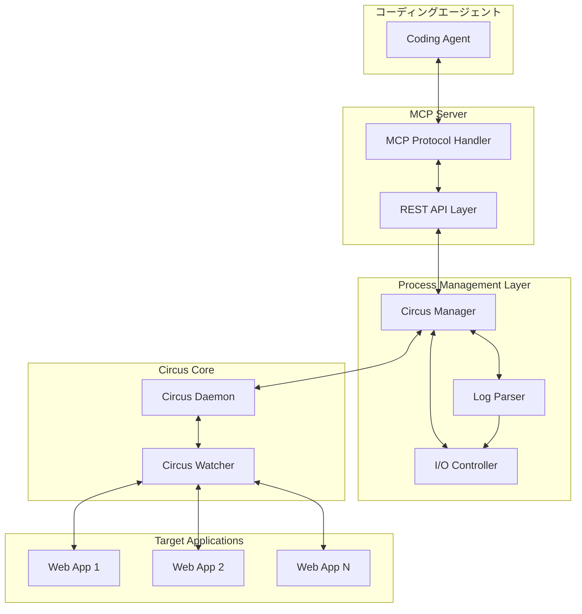

# Circus + MCPプロトコル対応プロセス管理システム設計書

## 1. システム概要

**目的**: 開発用Webアプリケーション（1-5個）をCircusで管理し、MCPプロトコルを通じてコーディングエージェントから制御可能なシステム

**主要機能**:
- プロセスの起動・停止・再起動・ステータス管理
- リアルタイムログ監視と標準入出力制御
- LogParserによるログパターン分類
- MCPプロトコル経由での外部制御

## 2. システムアーキテクチャ



## 3. 主要コンポーネント設計

### 3.1 Circus設定管理
- **circus.ini**: プロセス定義とwatcher設定
- **動的設定変更**: MCPからの設定更新機能
- **プロセステンプレート**: 新規アプリケーション追加用

### 3.2 MCPプロトコル実装
- **MCPサーバー**: JSON-RPC 2.0ベースの通信
- **ツール定義**: プロセス制御用のMCPツール
- **リソース管理**: ログやステータス情報の提供

### 3.3 ログ管理システム
- **LogParser**: 正規表現ベースのパターン分類
- **ログストリーミング**: リアルタイムログ配信
- **ログレベル分類**: ERROR, WARN, INFO, DEBUG

### 3.4 I/O制御システム
- **標準入力制御**: プロセスへのコマンド送信
- **標準出力監視**: リアルタイム出力キャプチャ
- **バッファリング**: 大量ログの効率的処理

## 4. 必要なPythonライブラリ

### 4.1 コアライブラリ
- **circus**: プロセス管理
- **zmq (pyzmq)**: Circusとの通信
- **asyncio**: 非同期処理
- **websockets**: リアルタイム通信

### 4.2 MCPプロトコル
- **mcp**: MCPプロトコル実装
- **jsonrpc-base**: JSON-RPC通信
- **pydantic**: データバリデーション

### 4.3 ログ処理
- **re**: 正規表現パターンマッチング
- **logging**: ログ管理
- **watchdog**: ファイル監視

### 4.4 ユーティリティ
- **psutil**: システム情報取得
- **pyyaml**: 設定ファイル管理
- **click**: CLI インターフェース

## 5. ファイル構成とモジュール設計

```
circus_mcp_manager/
├── config/
│   ├── circus.ini              # Circus設定ファイル
│   ├── log_patterns.yaml       # ログパターン定義
│   └── mcp_config.json         # MCP設定
├── src/
│   ├── circus_manager/
│   │   ├── __init__.py
│   │   ├── manager.py          # Circusマネージャー
│   │   ├── watcher.py          # プロセス監視
│   │   └── config_handler.py   # 設定管理
│   ├── mcp_server/
│   │   ├── __init__.py
│   │   ├── server.py           # MCPサーバー実装
│   │   ├── tools.py            # MCPツール定義
│   │   └── resources.py        # MCPリソース管理
│   ├── log_parser/
│   │   ├── __init__.py
│   │   ├── parser.py           # ログパーサー
│   │   ├── patterns.py         # パターン定義
│   │   └── classifier.py       # ログ分類
│   ├── io_controller/
│   │   ├── __init__.py
│   │   ├── input_handler.py    # 標準入力制御
│   │   ├── output_monitor.py   # 標準出力監視
│   │   └── stream_manager.py   # ストリーム管理
│   └── utils/
│       ├── __init__.py
│       ├── helpers.py          # ユーティリティ関数
│       └── exceptions.py       # カスタム例外
├── tests/
│   ├── test_circus_manager.py
│   ├── test_mcp_server.py
│   ├── test_log_parser.py
│   └── test_io_controller.py
├── docs/
│   ├── api_reference.md
│   ├── configuration.md
│   └── deployment.md
├── requirements.txt
├── setup.py
└── main.py                     # エントリーポイント
```

## 6. 詳細設計仕様

### 6.1 Circusの機能と使用方法

#### Circusとは
- Pythonで書かれたプロセス・ソケット管理ツール
- ZeroMQを使用した分散アーキテクチャ
- プロセスの監視、再起動、統計情報収集が可能

#### 主要機能
- **Watcher**: 個別プロセスの監視と管理
- **Arbiter**: 全体の調整とwatcherの管理
- **Stats**: プロセス統計情報の収集
- **Flapping**: プロセスの異常終了検出

#### 設定例
```ini
[circus]
check_delay = 5
endpoint = tcp://127.0.0.1:5555
pubsub_endpoint = tcp://127.0.0.1:5556

[watcher:webapp1]
cmd = python app.py
working_dir = /path/to/webapp1
numprocesses = 1
stdout_stream.class = FileStream
stdout_stream.filename = /var/log/webapp1.log
```

### 6.2 MCPプロトコルの仕様と実装方法

#### MCPプロトコル概要
- Model Context Protocol: AIエージェントとの標準通信プロトコル
- JSON-RPC 2.0ベースの双方向通信
- ツール（関数）とリソース（データ）の提供

#### 実装するMCPツール
1. **process_control**: プロセスの起動・停止・再起動
2. **get_status**: プロセス状態の取得
3. **send_input**: プロセスへの標準入力送信
4. **get_logs**: ログの取得とフィルタリング

#### MCPリソース
1. **process_list**: 管理対象プロセス一覧
2. **log_stream**: リアルタイムログストリーム
3. **system_stats**: システム統計情報

### 6.3 標準入出力制御の実装方式

#### 入力制御
- **非同期キュー**: 入力コマンドのバッファリング
- **プロセス通信**: subprocess.PIPEを使用した双方向通信
- **コマンド検証**: 危険なコマンドのフィルタリング

#### 出力監視
- **ストリーミング**: リアルタイム出力キャプチャ
- **バッファ管理**: メモリ効率的な出力処理
- **パターンマッチング**: ログレベルの自動分類

### 6.4 LogParserの詳細仕様

#### パターン定義
```yaml
patterns:
  error:
    - regex: "ERROR|Exception|Traceback"
      priority: 1
  warning:
    - regex: "WARNING|WARN"
      priority: 2
  info:
    - regex: "INFO|Starting|Stopping"
      priority: 3
  debug:
    - regex: "DEBUG"
      priority: 4
```

#### 分類機能
- **正規表現マッチング**: 複数パターンの並列処理
- **優先度制御**: 重複マッチ時の優先順位
- **カスタムパターン**: ユーザー定義パターンの追加

## 7. 実装フェーズ

### フェーズ1: 基盤構築（1-2週間）
1. Circusマネージャーの基本実装
2. 設定ファイル管理システム
3. 基本的なプロセス制御機能

### フェーズ2: I/O制御（1-2週間）
1. 標準入出力制御システム
2. ログ監視とストリーミング
3. LogParserの実装

### フェーズ3: MCPプロトコル統合（2-3週間）
1. MCPサーバーの実装
2. ツールとリソースの定義
3. コーディングエージェントとの連携テスト

### フェーズ4: 最適化と拡張（1週間）
1. パフォーマンス最適化
2. エラーハンドリング強化
3. ドキュメント整備

## 8. セキュリティ考慮事項

### 8.1 認証・認可
- **APIキー認証**: MCPアクセスの認証
- **権限ベースアクセス制御**: プロセス制御権限の制限
- **セッション管理**: 接続セッションの管理

### 8.2 データ保護
- **ログ保護**: 機密情報のマスキング
- **通信暗号化**: TLS/SSL通信の実装
- **入力検証**: SQLインジェクション等の防止

### 8.3 システム保護
- **リソース制限**: CPU・メモリ使用量の制限
- **プロセス分離**: 各アプリケーションの独立性確保
- **監査ログ**: 操作履歴の記録

## 9. 運用・保守

### 9.1 監視項目
- プロセス稼働状況
- システムリソース使用量
- ログエラー率
- MCP通信状況

### 9.2 バックアップ・復旧
- 設定ファイルのバックアップ
- ログファイルのローテーション
- プロセス状態の永続化

### 9.3 スケーラビリティ
- 水平スケーリング対応
- 負荷分散機能
- 動的リソース調整

## 10. 技術的課題と対策

### 10.1 パフォーマンス
- **課題**: 大量ログ処理時のメモリ使用量
- **対策**: ストリーミング処理とバッファサイズ制限

### 10.2 可用性
- **課題**: Circusプロセス自体の障害
- **対策**: ヘルスチェック機能とプロセス自動復旧

### 10.3 互換性
- **課題**: 異なるWebフレームワークとの互換性
- **対策**: 設定テンプレートとプラグイン機構

この設計書に基づいて、段階的な実装を進めることで、堅牢で拡張性の高いプロセス管理システムを構築できます。